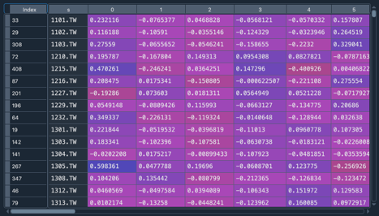
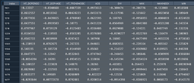
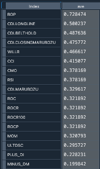
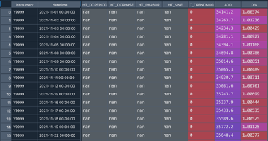
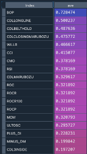
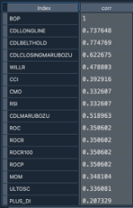
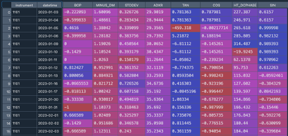

[[_TOC_]]

# Individualized-Indicator
* 重要的投資方法之一：技術交易指標作為歷史價格和交易量的數學總結

<br>

* 然而，具有不同屬性的股票與指標相比具有不同的親和力，於是設計了技術交易指標最佳化（TTIO）框架，利用股票屬性最佳化原始技術指標

<br>

* 為了獲得股票屬性的有效表示，提出Skip-gram架構學習股票特徵向量(根據基金經理的集體投資行為)

<br>

* 根據特徵向量，TTIO進一步最佳化指標的效能，並以新指標作為基準發展交易策略

<br>

## Project Architecture


## 使用方法

### 模組結構

```
Individualized-Indicator/
    ├── __init__.py
    ├── image/                          # 架構圖
    ├── main.py                         # 主程式
    ├── indicator_coefficient.py        # 模型訓練技術指標的係數的過程(128維)
    ├── dataset.py                      # 指標轉tensor、隔日收益、embedding
    ├── 標準化週期/             
    │    ├── __init__.py          
    │    └── spec.py                    # 清除NA、挑選使用指標(TOP_K)
    ├── NN_model/                    
    │    ├── __init__.py          
    │    ├── GE/                        # GNN計算embedding
    │    ├── dataset/
    │    │     ├── top_indicator/       # top_indicator
    │    │     └── stock_ind_del_na/    # 去NA個股的指標與收益的相關係數
    │    ├── dataset_DST.py             # 資料前處理etl
    │    └── nn.py                      # NN模型(訓練技術指標的係數)
    ├── backtest/                    
    │    ├── __init__.py
    │    └── backtest_pkl.py            # 訓練結果回測績效   
    ├── TEJ資料/
    │    └── 基金/
    │          └── stock.csv            # 上市櫃所有個股清單
    ├── emb/
    │    ├── preprocessing/             # 個股的embeddings(128維)(GNN訓練)
    │    └── year_month_day/            # Indicator_chose(TOP_K)
    ├── price/
    │    └── year_month_day/            # 開高低收、TSE
    └── 二原圖/
         └── fund/                      # 基金大表
```

### module

```
Class recommend_stock:
_init_
```
•	設定日期

•	基金資料讀取、持股資料整理

•	台股上市櫃的list

•	所有持股股價資訊(開高低收量)Plumber讀取

•	大盤資料讀取

•	持股股價資訊整理成開、高、低、收、量五個大表

•	持股股價資訊整理隔日收益

•	Talib的158個技術指標

•	持股股價資訊個股128維embedding的表格



```
New_indicator
```
•	整理持股技術指標的表


•	指標跟隔日收益的相關係數



•	各個指標的所有個股相關係數平均



```
tech_indicator
```
•	大盤的技術指標表



```
Class Top_k:
_init_
```
•	讀取各個指標的所有個股相關係數平均



```
clean_na_corr
```
•	計算大盤各指標與TOP指標的相關係數



•	大盤技術指標表去除與TOP指標相關係數NA值(無相關係數代表沒有指標數值)

•	去除指標的值unique < 6(代表指標只有小於6種數值)

```
indicator_info
```
•	選取與TOP指標相關性最小的指標作為第二挑選的指標

•	將各指標與TOP指標的相關係數表去掉相關性 > 0.3的項目

```
class Indicator_coefficient:
_init_
```
•	讀取indicator_top_list

•	讀取個股embeddings

```
calculate
New_indicator_IO
```
•	個股技術指標大表



•	隔日收益
•	個股embeddings

### Environment Setup
---

1. clone project

```python
git clone https://gitlab.com/dst-dev/individualized-indicator.git
```

2. 安裝所需套件

```python
sh local.sh
```